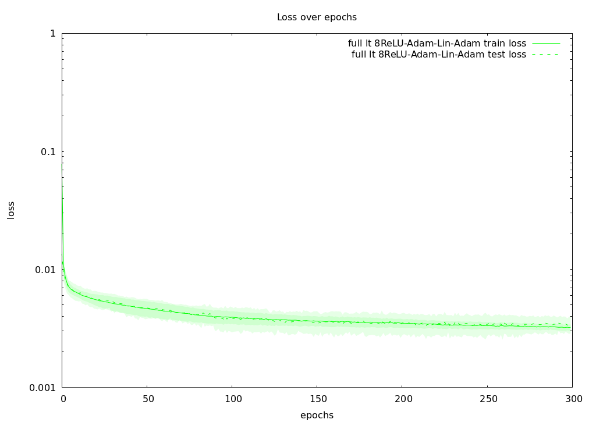
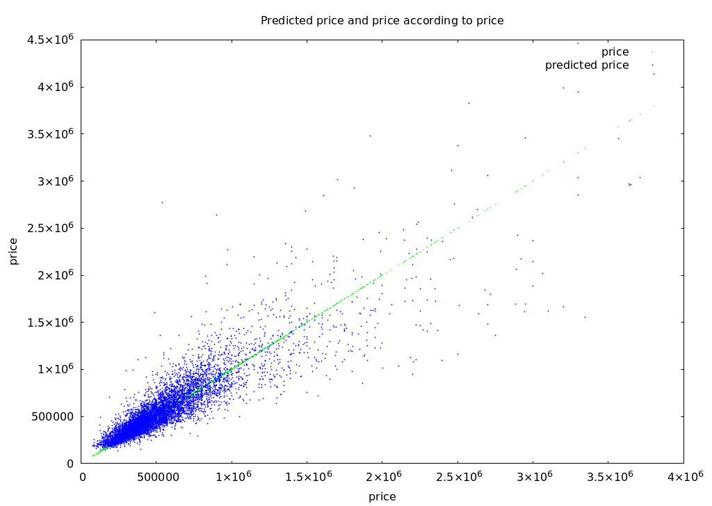
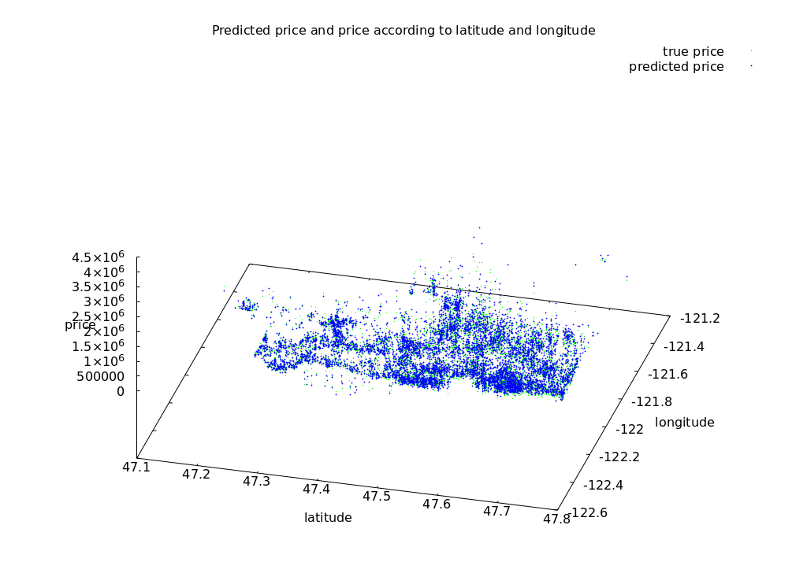
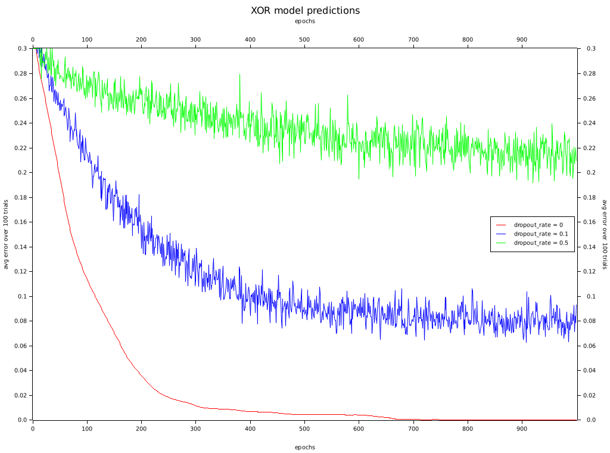
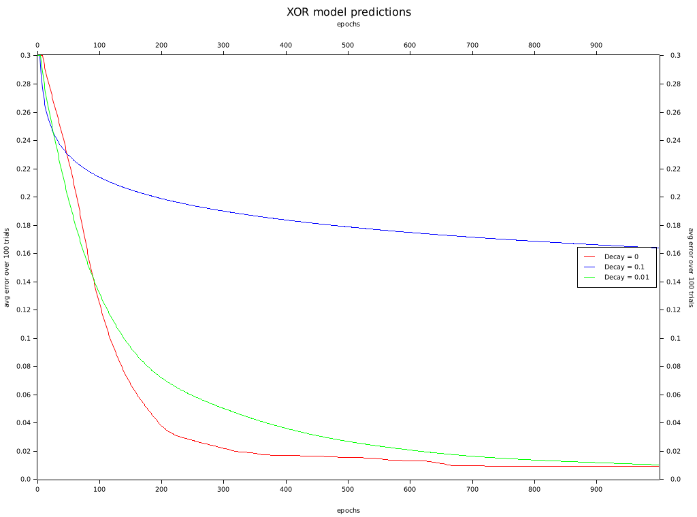
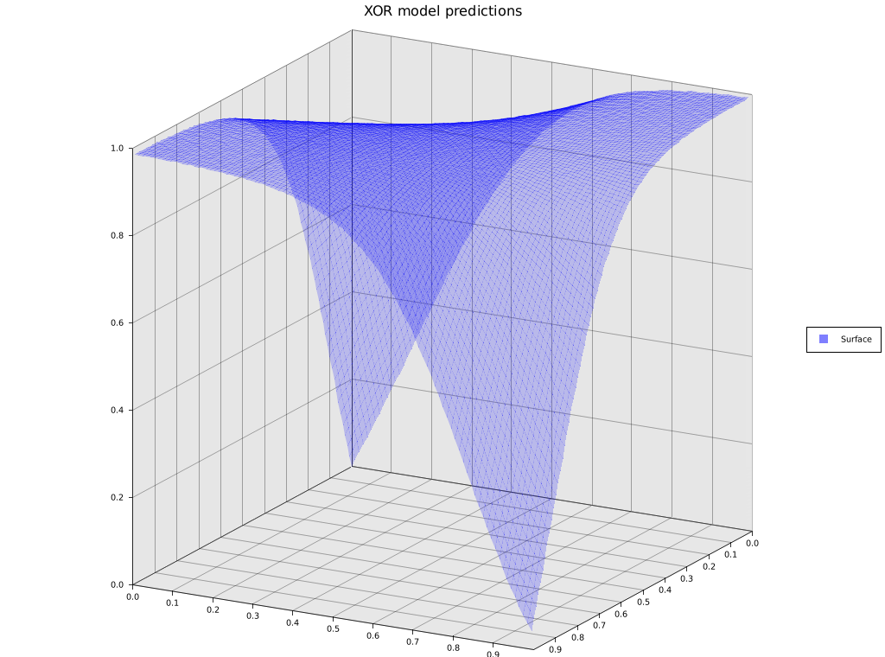

Implementing Neural Networks in Rust from scratch (using linear algebra libraries still).

## Working features

### Neural Networks

- Neural Network abstraction
- Layers
    - Shared abstraction
        - Forward/Backward passes
        - Handle (mini)batches
    - Dense layers
        - Weights optimizer/initializer (no regularization yet)
        - Biases optimizer/initializer (no regularization yet)
    - Activation layers
        - Linear
        - Hyperbolic Tangent
        - ReLU
        - Sigmoid
        - Tanh
    - Full layers (Dense + Activation)
        - Optional Dropout regularization
- Optimizers
    - Stochastic Gradient Descent (SGD)
    - Momentum SGD
    - Adam
- Initializers
    - Zeros
    - Random uniform (signed & unsigned)
    - Glorot uniform
- Losses
    - MSE

### Models utils

- Model specification
    - Simple API to create as code
    - From/to JSON conversion
    - Specify training parameters (k-folds, epochs...)
    - Specify the dataset
        - Features in/out
        - Features preprocessing
- Model benchmarking
    - Handy utilities to store & compute training metrics

### Preprocessing

- Layer-based data pipelines abstraction
    - Cached & revertible feature mapping/feature extraction layers
        - Normalize
        - Square
        - Log10 scale
        - Extract month from Date string
        - Extract unix timestamp from Date string
        - Limited row mapping (for advanced manipulations)
    - Row filtering layers
        - Filter outliers
    - Other layers
        - Attach IDs column

### Data analysis

- Simple Polars DataFrame wrapper (DataTable)
    - Load & manipulate CSV data
    - Generate input/output vectors
        - Sample
        - Shuffle
        - Split
        - K-folds
- `Vector<f64>` statistics & manipulation utils
    - Stats (mean, std dev, correlation, quartiles...)
    - Normalization

### Linear algebra

- Many backends for the Matrix type (toggled using compile-time cargo features)
    - nalgebra (default)
        - Fast
        - CPU-bound
    - linalg
        - 100% custom Vec-based
        - Slow
        - CPU-bound
    - linalg-rayon
        - linalg parallelized with rayon
        - Way faster than linalg but slower than nalgebra
        - CPU-bound

## Examples

### [King County House price regression](./examples/housing/)

Standard looking results by doing roughly [the same approach as a user named frederico on Kaggle using Pytorch](https://www.kaggle.com/code/chavesfm/dnn-house-price-r-0-88/notebook). Involving data manipulation with pipelines, and a 8 layers of ~20 inputs each model using ReLU & Adam. Training over 300 epochs with 8 folds k-folds.

Charts made with the gnuplot crate.








### [XOR function (deprecated example)](./examples/xor%5Bdeprecated%5D/)

Standard looking results. 

Charts made with the plotters crate.







### [Backend benchmarking](./examples/benchmark/)

Compute speed benchmark of the Matrix backends by trying to learn the following function + some Gaussian noise with 1024 params inputs:

```rs
pub fn f(x: &Vec<f64>) -> Vec<f64> {
    let mut res = vec![0.];

    for i in 0..x.len() {
        res[0] *= (x[i]).sin();
    }

    res
}
```

[Results available there](./examples/benchmark/results/).