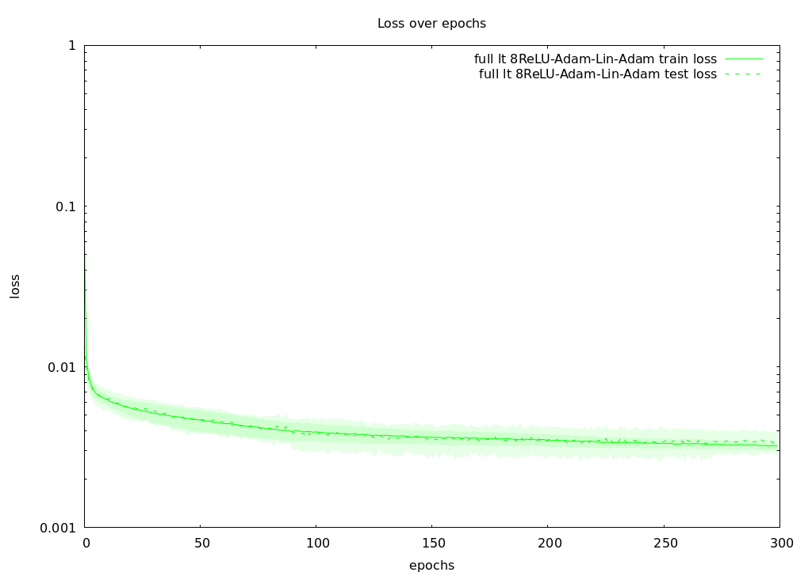

# King County House price regression

Standard looking results by doing roughly [the same approach as a user named frederico on Kaggle using Pytorch](https://www.kaggle.com/code/chavesfm/dnn-house-price-r-0-88/notebook). Involving data manipulation with pipelines, and a 8 layers of ~20 inputs each model using ReLU & Adam. Training over 300 epochs with 8 folds k-folds.

Charts made with the gnuplot crate.

